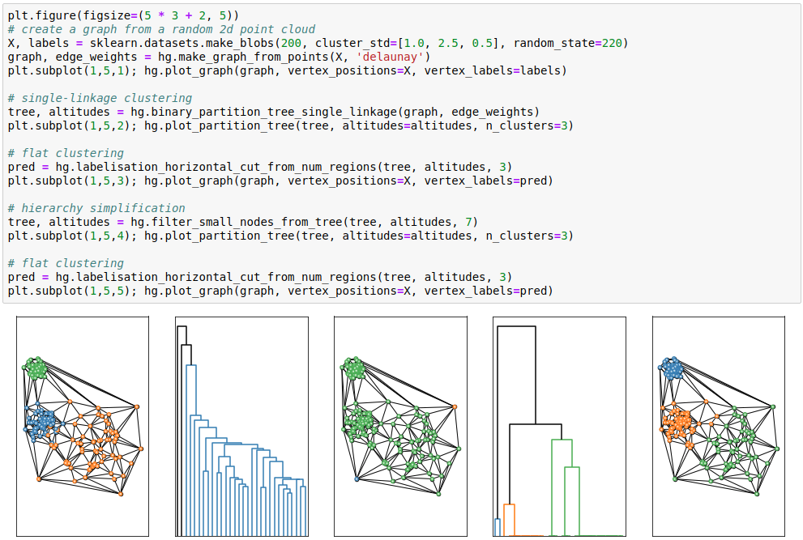
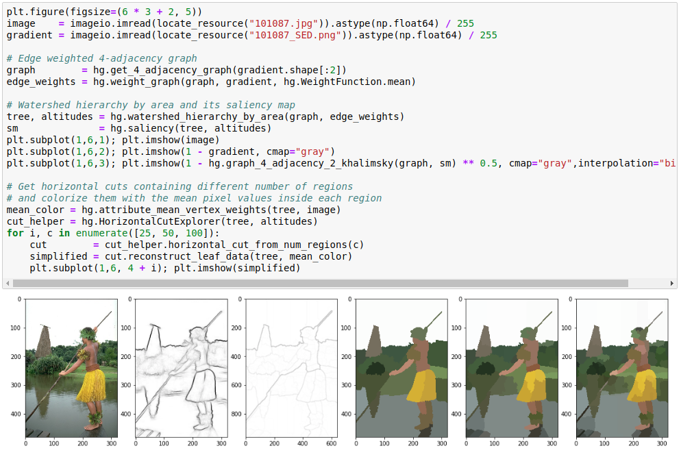

# Higra: Hierarchical Graph Analysis

[](https://travis-ci.org/higra/Higra) 
[](https://ci.appveyor.com/project/PerretB/higra-21ed3)
[](https://codecov.io/gh/higra/Higra)
[](https://higra.readthedocs.io/en/stable/?badge=stable)

Higra is a C++/Python library for efficient sparse graph analysis with a special focus on hierarchical methods. Some of the main features are:

- efficient methods and data structures to handle the dual representations of hierarchical clustering: trees (dendrograms) and saliency maps (ultrametric distances);
- hierarchical clusterings: quasi-flat zone hierarchy, hierarchical watersheds, agglomerative clustering (single-linkage, average-linkage, complete-linkage, exponential-linkage, Ward, or user provided linkage rule), constrained connectivity hierarchy;
- component trees: min and max trees;
- manipulate and explore hierarchies:  simplification, accumulators, cluster extraction, various attributes (size, volume, dynamics, perimeter, compactness, moments, etc.), horizontal and non-horizontal cuts, hierarchies alignment;
- optimization on hierarchies: optimal cuts, energy hierarchies;
- algorithms on graphs: accumulators, vertices and clusters dissimilarities, region adjacency graphs, minimum spanning trees and forests, watershed cuts;
- assessment: supervised assessment of graph clusterings and hierarchical clusterings;
- image toolbox: special methods for grid graphs, tree of shapes, hierarchical clustering methods dedicated to image analysis, optimization of Mumford-Shah energy.

Higra is thought for modularity, performance and seamless integration with classical data analysis pipelines. The data structures (graphs and trees) are decoupled from data (vertex and edge weights ) which are simply arrays ([xtensor](https://github.com/QuantStack/xtensor) arrays in C++ and [numpy](https://github.com/numpy/numpy) arrays in Python).

## Installation

The Python package can be installed with Pypi:

```bash
pip install higra
```

Supported systems: 

 - Python 3.4, 3.5, 3.6, 3.7
 - Linux 64 bits, macOS, Windows 64 bits


## Documentation

[https://higra.readthedocs.io/](https://higra.readthedocs.io/)

### Demonstration and tutorials

A collection of demonstration notebooks is available in the [documentation](https://higra.readthedocs.io/en/stable/notebooks.html). 
Notebooks are stored in a dedicated repository [Higra-Notebooks](https://github.com/higra/Higra-Notebooks).

### Code samples

This example demonstrates the construction of a single-linkage hierarchical clustering and its simplification by a cluster size criterion.

[](https://github.com/higra/Higra-Notebooks/blob/master/Illustrations%20of%20SoftwareX%202019%20article.ipynb)

This example demonstrates the use of hierarchical clustering for image filtering.

[](https://github.com/higra/Higra-Notebooks/blob/master/Illustrations%20of%20SoftwareX%202019%20article.ipynb)

## Developing C++ extensions

While Higra provides many vectorized operators to implement algorithms efficiently in Python, it is possible that
some operations cannot be done efficiently in Python. 
In such case, the [Higra-cppextension-cookiecutter](https://github.com/higra/Higra-cppextension-cookiecutter) enables
to easily setup and generate c++ extension using Higra with Python bindings.

## Third-party libraries

Higra bundles several third-party libraries (inside the `lib` folder): 

- [pybind11](https://github.com/pybind/pybind11) helps to create Python bindings of c++ methods and classes - [BSD-style license](https://github.com/pybind/pybind11/blob/master/LICENSE)
- [xtensor](https://github.com/QuantStack/xtensor) (with [xtl](https://github.com/QuantStack/xtl), [xsimd](https://github.com/QuantStack/xsimd), and [xtensor-python](https://github.com/QuantStack/xtensor-python) provides `numpy` like arrays for c++ with seamless integration with Python - all under the [BSD-3-Clause license](https://github.com/QuantStack/xtensor/blob/master/LICENSE)
- [Catch2](https://github.com/catchorg/Catch2) is a unit test framework - [Boost Software License 1.0](https://github.com/catchorg/Catch2/blob/master/LICENSE.txt)


