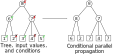
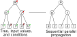
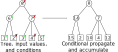

.. _tree:

Trees
=====

.. important::

    ``#include "higra/graph.hpp``

The `tree` class is the fundamental structure of many hierarchical representations of graphs.
In Higra, a tree is an undirected acyclic rooted graph (see :ref:`graph`), augmented with specific functions
matching the usual semantic of trees.

As with any graph in Higra, the vertices of a tree (also called *nodes*) are represented by positive integers suitable
for array indexing.
Higra's trees ensure that vertices are are topologically sorted, i.e. that for any vertices :math:`v1` and :math:`v2`, if
:math:`v2` is an ancestor of :math:`v1`, then :math:`v1\le v2`. Moreover, whenever a tree :math:`t` is a hierarchical
representation of a graph :math:`(V, E)`, then the leaves of :math:`t` are equal to :math:`V`: i.e. there is a direct
mapping between the leaves of the tree and the vertices of the graph represented by this tree.

The base of the `tree` data structure is the `parent array`: i.e. an array that indicates for each vertex the index of
its parent (for convenience, the root of the tree is its own parent).
For example, the following tree (leaves are represented by squares, inner nodes by circles, and vertex indices are
indicated inside the nodes):

is represented by the following parent array:

.. csv-table::

       node , 0 , 1 , 2 , 3 , 4 , 5 , 6 , 7 , 8 , 9 , 10 , 11
       parent , 7 , 7 , 8 , 8 , 8 , 9 , 9 , 11 , 10 , 10 , 11 , 11

Constructor
-----------

The ``tree`` class has a single constructor that takes a single parameter: the parent array.

Example:

.. tabs::

    .. tab:: python

        .. code-block:: python
            :linenos:

            import higra as hg

            # creates the tree shown in the figure above
            g = hg.Tree((7, 7, 8, 8, 8, 9, 9, 11, 10, 10, 11, 11))

    .. tab:: c++

        .. code-block:: cpp
            :linenos:

            #include "higra/graph.hpp"
            using namespace hg;

            // creates the tree shown in the figure above
            tree t({7, 7, 8, 8, 8, 9, 9, 11, 10, 10, 11, 11});

Basic functions
---------------

.. list-table::
    :header-rows: 1

    *   - Function
        - Returns
        - Description
    *   - ``num_leaves``
        - positive integer
        - Number of leaves in the tree
    *   - ``root``
        - vertex
        - Root node (last node of the parent array)
    *   - ``parent``
        - vertex
        - Parent(s) of the given node(s)
    *   - ``parents``
        - array of vertices
        - The parent array
    *   - ``is_leaf``
        - boolean
        - True if given node(s) is a leaf, False otherwise

Example:

.. tabs::

    .. tab:: python

        .. code-block:: python
            :linenos:

            # creates the tree shown in the figure above
            t = hg.Tree((7, 7, 8, 8, 8, 9, 9, 11, 10, 10, 11, 11))

            t.num_leaves()              # 7
            t.root()                    # 11

            t.parent(2)                 # 8
            t.parent((0, 11, 8))       # array {7, 11, 10}
            t.parents()                 # array {7, 7, 8, 8, 8, 9, 9, 11, 10, 10, 11, 11}

            t.is_leaf(4)                # True
            t.is_leaf(5)                # False
            t.is_leaf((0, 11, 8))       # array {True, False, False}

    .. tab:: c++

        .. code-block:: cpp
            :linenos:

            // creates the tree shown in the figure above
            tree t({7, 7, 8, 8, 8, 9, 9, 11, 10, 10, 11, 11});

            // two set of vertices
            array_1d<index_t> vertices{0, 11, 8};
            array_1d<index_t> vertices2{8, 11, 7};

            num_leaves(t);              // 7
            root(t);                    // 11

            parent(2, t);               // 8
            parent(vertices, t);        // array {7, 11, 10}
            parents(t);                 // array {7, 7, 8, 8, 8, 9, 9, 11, 10, 10, 11, 11}

            is_leaf(4, t);              // true
            is_leaf(5, t);              // false
            is_leaf(vertices, t);       // array {true, false, false}

Iterators
---------

.. list-table::
    :header-rows: 1

    *   - Function
        - Returns
        - Description
    *   - ``leaves_iterator`` (cpp) ``leaves`` (python)
        - a range of iterators
        - iterator on the leaves of the tree
    *   - ``ancestors_iterator`` (cpp) ``ancestors`` (python)
        - a range of iterators (cpp), a list (python)
        - iterator from a given node to the root of the tree (both included)
    *   - ``leaves_to_root_iterator``
        - a range of iterators
        - iterator on the nodes of the tree in a topological order
    *   - ``root_to_leaves_iterator``
        - a range of iterators
        - iterator on the nodes of the tree in a reverse topological order

.. tabs::

    .. tab:: python

        .. code-block:: python
            :linenos:

            # creates the tree shown in the figure above
            t = hg.Tree((7, 7, 8, 8, 8, 9, 9, 11, 10, 10, 11, 11))

            for n in t.leaves():
                ... # 0, 1, 2, ..., 6

            for n in t.ancestors(8):
                ... # 8, 10, 11

            for n in t.leaves_to_root_iterator(
                    include_leaves = True, # optional: include (default) or exclude leaves from the iterator
                    include_root = True): # optional: include (default) or exclude root from the iterator
                ... // 0, 1, 2, ..., 11

            for n in t.leaves_to_root_iterator(
                    include_leaves = False,
                    include_root = False):
                ... // 7, 8, 9, 10

            for n in t.root_to_leaves_iterator(
                    include_leaves = True, # optional: include (default) or exclude leaves from the iterator
                    include_root = True): # optional: include (default) or exclude root from the iterator
                ... // 11, 10, 9, ..., 0

            for n in t.root_to_leaves_iterator(
                    include_leaves = False,
                    include_root = False):
                ... // 10, 9, 8, 7

    .. tab:: c++

        .. code-block:: cpp
            :linenos:

            // creates the tree shown in the figure above
            tree t({7, 7, 8, 8, 8, 9, 9, 11, 10, 10, 11, 11});

            for(auto n: leaves_iterator(t)){
                ... // 0, 1, 2, ..., 6
            }

            for(auto n: ancestors_iterator(8, t)){
                ... // 8, 10, 11
            }

            for(auto n: leaves_to_root_iterator(t,
                    leaves_it::include /* optional: include (default) or exclude leaves from the iterator*/,
                    root_it::include /* optional: include (default) or exclude root from the iterator*/)){
                ... // 0, 1, 2, ..., 11
            }

            for(auto n: leaves_to_root_iterator(t,
                    leaves_it::exclude,
                    root_it::exclude)){
                    ... // 7, 8, 9, 10
            }

            for(auto n: root_to_leaves_iterator(t,
                    leaves_it::include /* optional: include (default) or exclude leaves from the iterator*/,
                    root_it::include /* optional: include (default) or exclude root from the iterator*/)){
                ... // 11, 10, 9, ..., 0
            }

            for(auto n: root_to_leaves_iterator(t,
                    leaves_it::exclude,
                    root_it::exclude)){
                    ... // 10, 9, 8, 7
            }

.. _tree children:

Children relation
-----------------

.. important::

    In C++ the children relation is only available on request: one must call the function ``compute_children`` prior
    to calling any of the following functions (otherwise the behaviour is undefined). Computing the children relation
    is a linear time operation that will require in the order of :math:`n + 3m` words of memory where :math:`n` is the number
    of nodes in the tree and :math:`m` is the number of non-leaf nodes (1 word is equal to 64bits on a x64 platform).

    The children relation can be cleared to save space with the function ``clear_children`` and the status of the relation
    can be checked with the function ``children_computed``.

    In Python the relation is automatically computed when needed, the relation can be cleared with the function ``clear_children``.

.. list-table::
    :header-rows: 1

    *   - Function
        - Returns
        - Description
    *   - ``num_children``
        - positive integer
        - Number(s) of children of the given node(s)
    *   - ``child``
        - vertex
        - i-th child of the given node(s)
    *   - ``children_iterator`` (cpp) ``children`` (python)
        - a range of iterators (cpp), a list (python)
        - iterator on the children of the given node
    *   - ``compute_children`` (cpp only)
        -
        - initialize the children relation (can be called several time safely)
    *   - ``children_computed`` (cpp only)
        -
        - ``true`` if the children relation has already been computed
    *   - ``clear_children``
        -
        - free up the space used to store the children relation

.. tabs::

    .. tab:: python

        .. code-block:: python
            :linenos:

            # creates the tree shown in the figure above
            t = hg.Tree((7, 7, 8, 8, 8, 9, 9, 11, 10, 10, 11, 11))

            t.num_children(8)           # 3
            t.num_children((0, 11, 8))  # array {0, 2, 3}

            t.child(1, 11)              # 10
            t.child(0, (8, 11, 7))      # array {2, 7, 0}

            for n in t.children(8):
                ... # 2, 3, 4

    .. tab:: c++

        .. code-block:: cpp
            :linenos:

            // creates the tree shown in the figure above
            tree t({7, 7, 8, 8, 8, 9, 9, 11, 10, 10, 11, 11});

            // IMPORTANT: compute the children relation first
            t.compute_children();

            t.children_computed();      // true

            // two set of vertices
            array_1d<index_t> vertices{0, 11, 8};
            array_1d<index_t> vertices2{8, 11, 7};

            num_children(8, t);         // 3
            num_children(vertices, t);  // array {0, 2, 3}

            child(1, 11, t);            // 10
            child(0, vertices2, t);     // array {2, 7, 0}

            for(auto n: children_iterator(t, 8)){
                ... // 2, 3, 4
            }

            // only if you lack memory and if you are sure that the children relation is not needed anymore
            t.clear_children();

Finding nodes
-------------

Common operations requires to find internal nodes corresponding to particular leaves of the tree.
Higra tree offers two helper methods for this:

  - ``lowest_common_ancestor`` finds the lowest common ancestor between two nodes ``n_1`` and ``n_2``, i.e.
    the smallest node of the tree that contains both ``n_1`` and ``n_2``; and
  - ``find_regions`` finds the highest node containing a node ``n_1`` and whose altitude is strictly lower than a given value.

Both functions can operate on scalars or arrays.
Both functions have a linear time complexity.

In case of lower common ancestor the helper class ``lca_fast/LCAFast`` (cpp/python) can provide a constant query time in exchange of a
linearithmic time pre-processing.

.. list-table::
    :header-rows: 1

    *   - Function
        - Returns
        - Description
    *   - ``lowest_common_ancestor``
        - node index
        - lowest common ancestor(s) of the given pair(s) of nodes
    *   - ``find_region``
        - node index
        - highest region(s) containing the given node(s) whose altitude if lower than the given altitude(s)

.. tabs::

    .. tab:: python

        .. code-block:: python
            :linenos:

                # tree node altitudes
                altitudes = numpy.asarray((0, 0, 0, 0, 0, 0, 0, 1, 1, 2, 4, 5))

                lca = t.lowest_common_ancestor(2, 5)                    # 10
                lcas = t.lowest_common_ancestor((2, 8, 0), (5, 6, 11))  # (10, 10, 11)

                // vertices and altitudes
                auto r = t.find_region((2, 8, 0), (1, 6, 2), altitudes) # (2, 11, 7)

    .. tab:: c++

        .. code-block:: cpp
            :linenos:

                // tree node altitudes
                array_1d<double> altitudes{0, 0, 0, 0, 0, 0, 0, 1, 1, 2, 4, 5};

                // two set of vertices
                array_1d<index_t> vertices1{2, 8, 0};
                array_1d<index_t> vertices2{5, 6, 11};

                auto lca = lowest_common_ancestor(2, 5, t);                    // 10
                auto lcas = lowest_common_ancestor(vertices1, vertices2, t);   // {10, 10, 11}

                // vertices and altitudes
                array_1d<index_t> vertices3{2, 8, 0};
                array_1d<double> alts{1, 6, 2};
                auto r = find_region(vertices, alts, altitudes, t);             // {2, 11, 7}

Accumulators
------------

Tree accumulators enables to efficiently accumulates values from the children of a node and move the accumulated value to this node.
They are especially important for writing efficient algorithms in Python by avoiding to use the tree iterators in many common scenarii.
Using them in C++ can also be beneficial as they are written to natively and efficiently handle n-dimensional data.

Each tree accumulator function has an ``accumulator`` parameter.
Currently, the following accumulators are defined:

- ``mean`` : computes the average of the provided value (default value: 0)
- ``minimum`` : computes the minimum of the provided value (default value: maximal representable value for the specific data type)
- ``maximum`` : computes the maximum of the provided value (default value: minimal representable value for the specific data type)
- ``counter`` : computes the number of provided value (default value: 0)
- ``sum`` : computes the sum of the provided value (default value: 0)
- ``prod`` : computes the product of the provided value (default value: 1)

Default values and results of the accumulators have the same shape/dimension of the input values, except for the counter accumulator which is always a scalar integer.

Accumulators are wrapped into *factories* in C++ while the Python interface only exposes an enumeration (real accumulator types are currently not exported in Python).

.. tabs::

    .. tab:: python

        .. code-block:: python
            :linenos:

            acc = hg.Accumulators.sum

    .. tab:: c++

        .. code-block:: cpp
            :linenos:

            auto acc = accumulator_sum();

Parallel accumulator
~~~~~~~~~~~~~~~~~~~~

The parallel accumulator defines the new value of a node as the accumulation of the values of its children.
This process is done in parallel on the whole tree.

The parallel accumulator pseudo-code could be:

.. code-block:: python
    :linenos:

    # input: a tree t
    # input: an attribute att on the nodes of t
    # input: an accumulator acc

    output = empty_like(input)

    for each node n of t:
        output[n] = acc(input[t.children(n)])

    return output

The following example demonstrates the application of a parallel sum accumulator on a simple tree:

.. tabs::

    .. tab:: python

        .. code-block:: python
            :linenos:

            # tree in the above example
            t = hg.Tree((5, 5, 6, 6, 6, 7, 7, 7))
            input = numpy.ones((t.num_vertices(),))

            result = hg.accumulate_parallel(t, input, hg.Accumulators.sum)

            # result = (0, 0, 0, 0, 0, 2, 3, 2)

    .. tab:: c++

        .. code-block:: cpp
            :linenos:

            // tree in the above example
            tree t({5, 5, 6, 6, 6, 7, 7, 7});
            array_1d<index_t> input = xt::ones({num_vertices(t)});

            auto result = accumulate_parallel(t, input, hg::accumulator_sum());

            // result = {0, 0, 0, 0, 0, 2, 3, 2};

Sequential accumulator
~~~~~~~~~~~~~~~~~~~~~~

The sequential accumulator defines the new value of a node as the accumulation of the accumulated values of its children.
This process is thus done sequentially from the leaves to the root of the tree.

The sequential accumulator pseudo-code could be:

.. code-block:: python
    :linenos:

    # input: a tree t
    # input: an attribute att on the leaves of t
    # input: an accumulator acc

    output = empty(t.num_vertices())
    output[0:t.num_leaves()] = input

    for each non-leaf node n of t from the leaves to the root:
        output[n] = acc(output[t.children(n)])

    return output

The following example demonstrates the application of a sequential sum accumulator on a simple tree:

.. tabs::

    .. tab:: python

        .. code-block:: python
            :linenos:

            # tree in the above example
            t = hg.Tree((5, 5, 6, 6, 6, 7, 7, 7))
            input = numpy.ones((t.num_leaves(),))

            result = hg.accumulate_sequential(t, input, hg.Accumulators.sum)

            # result = (1, 1, 1, 1, 1, 2, 3, 5)

    .. tab:: c++

        .. code-block:: cpp
            :linenos:

            // tree in the above example
            tree t({5, 5, 6, 6, 6, 7, 7, 7});
            array_1d<index_t> input = xt::ones({num_leaves(t)});

            auto result = accumulate_sequential(t, input, hg::accumulator_sum());

            // result = {1, 1, 1, 1, 1, 2, 3, 5};

Sequential and combine accumulator
~~~~~~~~~~~~~~~~~~~~~~~~~~~~~~~~~~

The sequential and combine accumulator defines the new value of a node as the accumulation of the accumulated values of its children combined with another node dependent value.
This process is thus done sequentially from the leaves to the root of the tree.

The sequential accumulator pseudo-code could be:

.. code-block:: python
    :linenos:

    # input: a tree t
    # input: an attribute att1 on the leaves of t
    # input: an attribute att2 on the nodes of t
    # input: an accumulator acc
    # input: a function combine

    output = empty(t.num_vertices())
    output[0:t.num_leaves()] = att1

    for each non-leaf node n of t from the leaves to the root:
        output[n] = combine(acc(output[t.children(n)]), att2[n])

    return output

The following example demonstrates the application of sequential max accumulator with a sum combiner on a simple tree:

.. image:: fig/tree_demo_accumulate_and_combine_sequential.svg
    :align: center

.. tabs::

    .. tab:: python

        .. code-block:: python
            :linenos:

            # tree in the above example
            t = hg.Tree((5, 5, 6, 6, 6, 7, 7, 7))
            leaf_attribute = numpy.ones((t.num_leaves(),))
            tree_attribute = numpy.ones((t.num_vertices(),))

            result = hg.accumulate_and_add_sequential(t, tree_attribute, leaf_attribute, hg.Accumulators.max)

            # result = (1, 1, 1, 1, 1, 2, 2, 3)

    .. tab:: c++

        .. code-block:: cpp
            :linenos:

            // tree in the above example
            tree t({5, 5, 6, 6, 6, 7, 7, 7});
            array_1d<index_t> leaf_attribute = xt::ones({num_leaves(t)});
            array_1d<index_t> tree_attribute = xt::ones({num_vertices(t)});

            auto result = accumulate_and_combine_sequential(t,
                                                            tree_attribute,
                                                            leaf_attribute,
                                                            hg::accumulator_max(),
                                                            std::plus<index_t>());

            // result = {1, 1, 1, 1, 1, 2, 2, 3};

Note that currently, to ease the binding of this accumulator to Python, the combining function cannot be specified at runtime
and the library offers several statically bound functions:

- ``accumulate_and_add_sequential``
- ``accumulate_and_sum_sequential``
- ``accumulate_and_multiply_sequential``
- ``accumulate_and_min_sequential``
- ``accumulate_and_max_sequential``

Propagators
-----------

A propagator efficiently move values from a node to its children (it can be seen as the inverse of the accumulators).
They are especially important for writing efficient algorithms in Python by avoiding to use the tree iterators in many common scenarii.
Using them in C++ can also be beneficial as they are written to natively and efficiently handle n-dimensional data.

Conditional parallel propagator
~~~~~~~~~~~~~~~~~~~~~~~~~~~~~~~

The conditional parallel propagator defines the new value of a node as its parent value if the condition is true and keeps its value otherwise.
This process is done in parallel on the whole tree. The default condition (if the user does not provide one) is true for all nodes: each node takes
the value of its parent.

The conditional parallel propagator pseudo-code could be:

.. code-block:: python
    :linenos:

    # input: a tree t
    # input: an attribute att on the nodes of t
    # input: a condition cond on the nodes of t

    output = copy(input)

    for each node n of t:
        if(cond(n)):
            output[n] = input[t.parent(n)]

    return output

The following example demonstrates the application of a conditional parallel propagation:

.. tabs::

    .. tab:: python

        .. code-block:: python
            :linenos:

            # tree in the above example
            t = hg.Tree((5, 5, 6, 6, 6, 7, 7, 7))
            input = numpy.asarray((1, 2, 3, 4, 5, 6, 7, 8))
            condition = numpy.asarray((True, False, True, False, True, True, False, False))

            result = hg.propagate_parallel(t, input, condition)

            # result = (6, 2, 7, 4, 7, 8, 7, 8)

    .. tab:: c++

        .. code-block:: cpp
            :linenos:

            // tree in the above example
            tree t({5, 5, 6, 6, 6, 7, 7, 7});
            array_1d<index_t> input{1, 2, 3, 4, 5, 6, 7, 8};
            array_1d<bool> condition{true, false, true, false, true, true, false, false};

            auto result = propagate_parallel(t, input, condition);

            // result = {6, 2, 7, 4, 7, 8, 7, 8};

Conditional sequential propagator
~~~~~~~~~~~~~~~~~~~~~~~~~~~~~~~~~

The conditional sequential propagator defines the new value of a node as its parent propagated value if the condition is true and keeps its value otherwise.
This process is thus done from the root to the leaves of the tree.
The new root value is always equal to its current value: the condition on the root is ignored.

The conditional sequential propagator pseudo-code could be:

.. code-block:: python
    :linenos:

    # input: a tree t
    # input: an attribute att on the nodes of t
    # input: a condition cond on the nodes of t

    output = copy(input)

    for each node n of t from the root (excluded) to the leaves:
        if(cond[n]):
            output[n] = output[t.parent(n)]

    return output

The following example demonstrates the application of a conditional sequential propagation:

.. tabs::

    .. tab:: python

        .. code-block:: python
            :linenos:

            # tree in the above example
            t = hg.Tree((5, 5, 6, 6, 6, 7, 7, 7))
            input = numpy.asarray((1, 2, 3, 4, 5, 6, 7, 8))
            condition = numpy.asarray((True, False, True, False, True, True, False, False))

            result = hg.propagate_sequential(t, input, condition)

            # result = (8, 2, 7, 4, 7, 8, 7, 8)

    .. tab:: c++

        .. code-block:: cpp
            :linenos:

            // tree in the above example
            tree t({5, 5, 6, 6, 6, 7, 7, 7});
            array_1d<index_t> input{1, 2, 3, 4, 5, 6, 7, 8};
            array_1d<bool> condition{true, false, true, false, true, true, false, false};

            auto result = propagate_sequential(t, input, condition);

            // result = {8, 2, 7, 4, 7, 8, 7, 8};

Sequential propagate and accumulate
~~~~~~~~~~~~~~~~~~~~~~~~~~~~~~~~~~~

The sequential propagate and accumulate defines the new value of a node as its parent value accumulated with its current value.
This process is done from the root to the leaves of the tree.

The propagate and accumulate pseudo-code could be:

.. code-block:: python
    :linenos:

    # input: a tree t
    # input: an attribute att on the nodes of t
    # input: an accumulator acc

    output[t.root] = acc(input[t.root])

    for each node n of t from the root (excluded) to the leaves:
        output[n] = acc(output[t.parent(n)], input[n])

    return output

The following example demonstrates the application of a propagate and accumulate with a sum accumulator:

.. tabs::

    .. tab:: python

        .. code-block:: python
            :linenos:

            # tree in the above example
            t = hg.Tree((5, 5, 6, 6, 6, 7, 7, 7))
            input = numpy.asarray((1, 2, 3, 4, 5, 6, 7, 8))

            result = hg.propagate_sequential_and_accumulate(t, input, hg.Accumulators.sum)

            # result = (15, 16, 18, 19, 20, 14, 15, 8)

    .. tab:: c++

        .. code-block:: cpp
            :linenos:

            // tree in the above example
            tree t({5, 5, 6, 6, 6, 7, 7, 7});
            array_1d<index_t> input{1, 2, 3, 4, 5, 6, 7, 8};

            auto result = propagate_sequential_and_accumulate(t, input, hg::accumulator_sum());

            // result = {15, 16, 18, 19, 20, 14, 15, 8};

.. _tree conditional propagate and accumulate:

Conditional sequential propagate and accumulate
~~~~~~~~~~~~~~~~~~~~~~~~~~~~~~~~~~~~~~~~~~~~~~~

The conditional sequential propagate and accumulate defines the new value of a node :math:`n` as

 - if the condition is true on :math:`n`, the accumulation of the node current value and, if the node has a parent, of
   its parent value; and
 - its current value otherwise

This process is done from the root to the leaves of the tree.

The conditional propagate and accumulate pseudo-code could be:

.. code-block:: python
    :linenos:

    # input: a tree t
    # input: an attribute att on the nodes of t
    # input: a condition cond on the nodes of t
    # input: an accumulator acc

    output[t.root] = acc(input[t.root]) if cond[t.root()] else input[t.root]

    for each node n of t from the root (excluded) to the leaves:
        if(cond[n]):
            output[n] = acc(output[t.parent(n)], input[n])
        else:
            output[n] = input[n]

    return output

The following example demonstrates the application of a conditional propagate and accumulate with a sum accumulator:

.. tabs::

    .. tab:: python

        .. code-block:: python
            :linenos:

            # tree in the above example
            t = hg.Tree((5, 5, 6, 6, 6, 7, 7, 7))
            input = numpy.asarray((1, 2, 3, 4, 5, 6, 7, 8))
            condition = numpy.asarray((True, False, True, False, True, True, False, False))

            result = hg.propagate_sequential_and_accumulate(t, input, hg.Accumulators.sum, condition)

            # result = (15, 2, 10, 4, 12, 14, 7, 8)

    .. tab:: c++

        .. code-block:: cpp
            :linenos:

            // tree in the above example
            tree t({5, 5, 6, 6, 6, 7, 7, 7});
            array_1d<index_t> input{1, 2, 3, 4, 5, 6, 7, 8};
            array_1d<bool> condition{true, false, true, false, true, true, false, false};

            auto result = propagate_sequential_and_accumulate(t, input, hg::accumulator_sum(), condition);

            // result = {15, 2, 10, 4, 12, 14, 7, 8};
