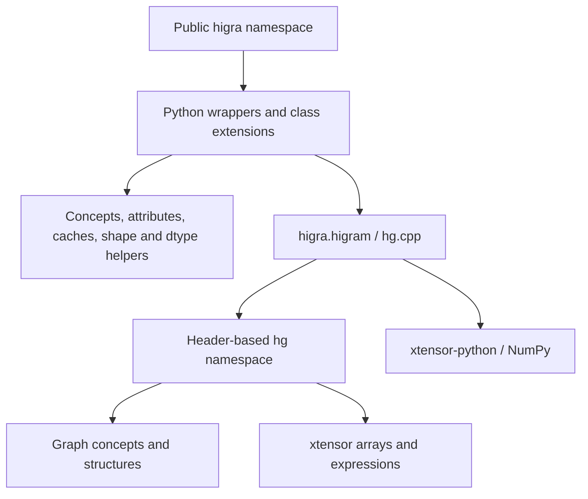

# Architecture

This describes the checked-in implementation. Build commands and platform
constraints belong in [build-and-test.md](build-and-test.md); ownership and
implementation details belong in the C++ and binding guides.

## Layers and data flow

`include/higra/` contains the C++ core. There is no separate compiled core
library target in the root build: the bindings and C++ tests instantiate the
headers. Python-independent consumers can include those headers, but the root
CMake project always configures a Python extension.

Topology lives in graph/tree objects. Weights, labels, node altitudes, and other
attributes are separate arrays. Generic algorithms use graph traits and free
functions rather than requiring every input to be an explicit `ugraph`.

## C++ module map

| Location under `include/higra/` | Role and useful entry points |
| --- | --- |
| `graph.hpp`, `structure/` | Graph API/traits; `undirected_graph.hpp`, `regular_graph.hpp`, `tree_graph.hpp`; embeddings, arrays, union-find, heaps, LCA |
| `structure/details/` | Iterators, graph concepts, indexed edges, light axis views, range-minimum-query implementations |
| `accumulator/` | Reusable accumulator types and graph/tree reductions; `tree_accumulator.hpp`, `graph_accumulator.hpp` |
| `attribute/tree_attribute.hpp` | C++ tree measurements; many further attributes are composed in Python |
| `algo/` | Graph/tree operations, watershed, RAGs, horizontal cuts, alignment, monotonic regression, energy optimization |
| `hierarchy/` | Component trees, binary partition trees/agglomeration, watershed hierarchies, simplification, CASF |
| `image/` | Image-grid conversion, contours, mean-PB hierarchy, tree of shapes |
| `assessment/` | Partition scores, fragmentation, dendrogram purity; inspect registration before assuming Python exposure |
| `io/` | Pink graph, tree, and PNM serialization; Python I/O lives under `higra/io_utils/` |
| `detail/hierarchy/` | Dynamic trees, incremental attribute computers, dual min/max updates used by CASF |
| `utils.hpp`, `sorting.hpp`, `detail/log.hpp`, `config.hpp` | Indices, validation/type macros, parallel loop helper, sorting, logging, version |

`hierarchy/common.hpp` defines `node_weighted_tree` (tree plus altitudes) and
`remapped_tree` (new tree plus map to original node IDs). These encode relationships
that Python often exposes as tuples or the bound `SimplifiedTree` class.

## Bindings and package exports

[higra/pymodule.cpp](../../higra/pymodule.cpp) defines
`PYBIND11_MODULE(higram, m)`, initializes NumPy once,
and calls the binding initializer functions. `higra/all.hpp` includes module
`all.hpp` aggregates, which include binding declarations.

Each binding implementation generally includes the matching C++ header, defines
concrete dtype/graph overloads, and registers functions or classes. Most wrapped
algorithm entry points start with `_`; access them through `hg.cpp`, since
Python star imports exclude underscored names. Directly exposed functions and
classes also exist, so underscore naming is a recurring pattern rather than a
universal rule.

[higra/__init__.py](../../higra/__init__.py) loads:

1. The extension, also aliased as `cpp`.
2. `data_cache`, `concept`, and `hg_utils`, including cache initialization.
3. Algorithm, attribute, hierarchy, image, interop, plotting, and structure
   modules through their package exports.

The early modules provide decorators used while later modules are imported.
`higra/structure/*.py` adds methods, constructors, and pickle behavior to bound
classes with `@hg.extend_class`. Read both layers when changing `Tree`, regular
graphs, embeddings, or LCA behavior.

## Representative paths

**Component tree construction:**
`higra/hierarchy/component_tree.py` linearizes grid-shaped vertex data, calls
`hg.cpp._component_tree_max_tree`, and links the output to its leaf graph with
`CptHierarchy.link`. `py_component_tree.cpp` instantiates numeric overloads for
explicit graphs and selected regular-grid dimensions. The C++ implementation
sorts vertices stably, uses union-find, canonizes components, and produces a
static tree and altitudes.

**Tree area:** `higra/attribute/tree_attributes.py::attribute_area` uses
`argument_helper` to infer the leaf graph and `auto_cache` to reuse results. It
selects leaf areas and calls `accumulate_sequential`. The binding dispatches an
accumulator enum to a C++ accumulator type. This API has no single C++ function
with exactly the same full wrapper behavior.

**CASF:** `higra/hierarchy/component_tree_dual_filter.py` resolves an attribute,
linearizes data, calls its binding, and restores the image shape. The binding
constructs a `ComponentTreeCasf` for that call. C++ maintains mutable min/max
trees and attribute/altitude buffers. See
[incremental-component-trees.md](incremental-component-trees.md).

## Metadata, caches, and optional modules

Python concepts encode associations: grid shape, a hierarchy's leaf graph,
region-adjacency maps, and a binary hierarchy's MST and edge map. They are tags
and attributes, not C++ inheritance. `argument_helper` reads these associations
to fill missing parameters.

`data_cache.py` stores attributes on objects with dynamic attributes and uses a
weak-reference store as a fallback. The `auto_cache` result cache separately
associates results with a reference object. Do not assume all metadata is in the
global cache or that one clearing function resets every kind of state.

NumPy is required. SciPy and scikit-learn support selected graph APIs and are
needed by the full Python tests. Plotting checks for optional SciPy/Matplotlib
availability. SciPy linkage conversion includes C++ code and is not merely a
call into SciPy.

## Sources versus artifacts

CMake copies registered Python files/tests into a parallel build-tree layout and
builds `higra/higram<extension-suffix>`. Setuptools packages the extension along
with temporary copies of core/vendor headers. Documentation is generated from
`doc/source/`, public docstrings, and Doxygen XML.

The Markdown files in `docs/agents/` are repository guidance, outside the Sphinx
source tree. Their existence does not add a documentation runtime dependency.
